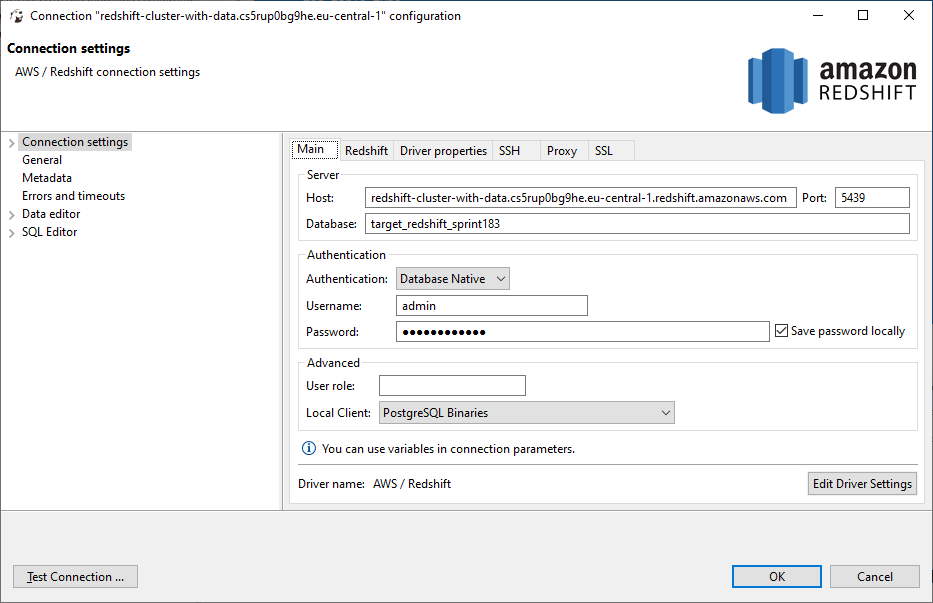

= Setup your environment for the Redshift Generator 

== Download and Installation of Software

|============================
| No | Tool | Link | Important Notes

| 1 | Python 3.9 | https://www.python.org/downloads/ | During installation: Don't forget to check the box next to "Python 3.9 to PATH" 
| 2 | Python modules| (open command prompt and type ...) | 1. pip install pyodbc 

2. pip install boto3

| 3 | VS Code | https://code.visualstudio.com/download | During installation: Don't forget to check the box next to "Python 3.9 to PATH" 
| 4 | Redshift ODBC 64-bit driver | https://s3.amazonaws.com/redshift-downloads/drivers/odbc/1.4.14.1000/AmazonRedshiftODBC64-1.4.14.1000.msi |
| 5 | DBeaver Database Tool | https://dbeaver.io/download/ | 
|============================

== Setup Connection in DBeaver

. Start DBeaver and in the menu select Database/New Database Connection
. Select *Redshift* as your database
. Insert following values for the Connection Settings:
.. host = redshift-cluster-with-data.cs5rup0bg9he.eu-central-1.redshift.amazonaws.com
.. Port = 5439
.. Database = target_redshift_sprint183
.. Authentication = Database Native
.. Username = admin
.. Password = _Please ask your colleagues_
.. Click the tab *Redshift* and select *Show all databases*
.. With *Test connection* you can test the settings
.. Close the dialog with *OK*

image::DBeaver_Connection_Redshift.png[]

